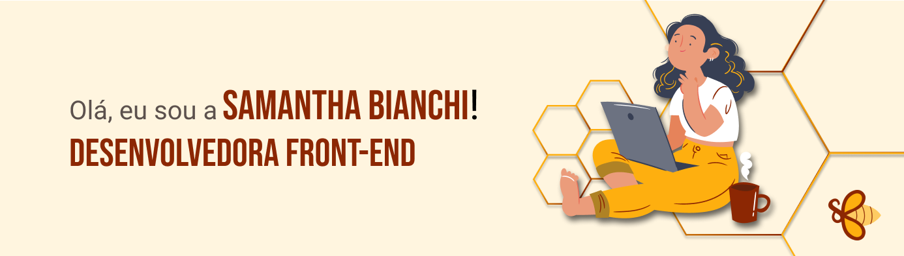

### Aqui você pode apreciar alguns dos meus projetos pessoais, colaborativos e de hackathons, além dos desenvolvidos na jornada do Bootcamp de Desenvolvimento Web Full-Stack da Resilia Educação.

- 👩‍💻 Sou Desenvolvedora Front-end
- 🎓 Formada no curso técnico de Desenvolvimento Web Full-Stack na Resilia Educação - concluído em março/2021
- 🤯 Viciada em participar de hackathons
- 🎬 Nas horas vagas sou a louca das séries
- Recentemente nadei na Piscina da 42
<h2 aLign="left"> <a href="#">

--- 
## 📫 Você pode entrar em contato comigo através do meu:
 
  
 
 
 

## Minhas Competências
        

---

 
  <a href="https://github.com/SahBianchi">
  
  
   

 ---  
 

 

