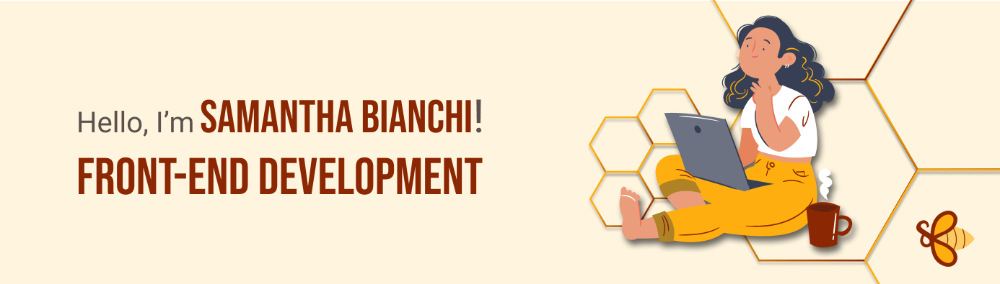

 
 

I'm Samantha Bianchi, my career began as a graphic designer and in 2021 I started my transition by taking a full stack web development bootcamp. At the end of the course, I participated in a hackathon and the project created with my team was awarded second place. After that, it became an addiction, and I've already participated in 5 more and had the pleasure of being awarded first place in another project.
In August 2023, I swam in the 42sp pool in Brazil, and I'm currently in the Ada selection process with Santander Coders and I finished the first part of the introductory Data Engineering course, I'm also completing the ONE Oracle front end development course.

 
 

## ⚙️ My Skills:
        

 

## 📫 Contact Me:
 
  
 
 
 
 

## 🔥 GitHub Stats:

 
  <a href="https://github.com/SahBianchi">
  
  
   

 ---  
 

 

